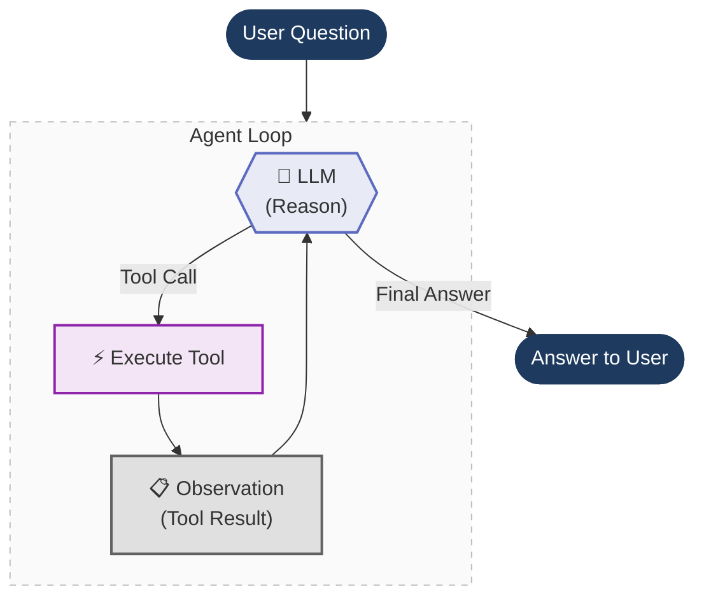

# Langchain
 - Langchain Docs:Agents ://docs.langchain.com/oss/python/langchain/agents
 - TAVILY : https://app.tavily.com/home?utm_campaign=eden_marco&utm_medium=socials&utm_source=linkedin
          : https://docs.tavily.com/sdk/python/quick-start
 - Langchain Tavily Integration : https://docs.langchain.com/oss/python/integrations/providers/tavily
 
- Structured Output - Pydantic - https://docs.langchain.com/oss/python/langchain/structured-output

- ChatPromptTemplate Docs - https://reference.langchain.com/python/langchain-core/prompts
- ChatModels Docs - https://reference.langchain.com/python/langchain/models
- Claude Docs - https://platform.claude.com/docs/en/agents-and-tools/tool-use/overview
- Ollama Docs - https://docs.ollama.com/
- Initial ReACT prompt - https://smith.langchain.com/hub/hwchase17/react?organizationId=a7f8bd85-b797-5733-8038-ce1ba498c5e8
- Python Regular Expression Module - https://docs.python.org/3/library/re.html
- Python INSPECT module - https://docs.python.org/3/library/inspect.html


# LangChain Workflow — One-Line Pointers
- User Query → Raw input from the user, often unstructured and ambiguous.
- Prompt Template → Transforms the query into a structured, instruction-rich prompt.
- Language Model (1st Call) → Interprets the prompt and generates intermediate structured output.
- Output Parser → Converts LLM output into clean, validated, machine-readable data.
- External API / Tool Call → Fetches real-world data or executes logic using parsed inputs.
- Final LLM Call → Synthesizes API results into a meaningful, human-readable response.
- Final Output → Delivers the refined, accurate answer back to the user.


# Using OLLAMA
- https://ollama.com/search

- in command prompt > ollama       #in terminal, run the following commands to set up Ollama and pull the Gemma 4 model:
- ollama pull qwen3:1.7b               # Pull the qwen3 model from Ollama
- ollama list                      # List the available models in Ollama
- ollama rm <MODEL_NAME>           #Run the following command replacing MODEL_NAME with the name from your list to Remove the model


uv is an extremely fast Python package and project manager (written in Rust) that serves as a modern replacement for pip, pip-tools, and virtualenv.

- # delete old env - rm -rf .venv   # (Windows: rmdir /s /q .venv)

- uv init . # Create a virtual environment in the current directory
- uv venv # create a virtual environment using uv. It will install latest python version
- uv venv --python 3.10 #install specific version of pythin in environment
- .venv\Scripts\activate # Activate the virtual environment (Windows)
- uv pip list # List installed packages in the virtual environment
- uv add langchain-openai openai python-dotenv pydantic streamlit # Add required packages to the virtual environment
- uv pip install -r requirements.txt # Install dependencies from the requirements file
- uv run app.py #Runs your script using the project's environment.
- uv run streamlit run app.py # Runs your Streamlit app using the project's environment.


- git checkout --orphan project/hello-world # Create a new orphan branch named "project/hello-world"
- git rm -rf . # Remove all files from the index

- git add . # Stage all changes for commit
- git commit -m "Add main.py and update requirements.txt and .env files" # Commit with a message
- git push --set-upstream origin project/hello-world # Push the changes to the remote repository and set the upstream branch to project/hello-world
- git checkout -b project/agents-under_the_hood commitid  #This command creates a new branch called "project/agents-under_the_hood" and checks it out. The "commitid" is a placeholder for the specific commit ID that you want to base this new branch on. You would replace "commitid" with the actual commit hash that you want to use as the starting point for your new branch. This allows you to work on a new feature or project while keeping the main branch clean and organized.


Q & A
==========
## 1. Why does the agent use a loop instead of a single LLM call?

-  The agent often needs multiple interactions with the LLM to gather necessary data from various tools before forming a final response, demonstrating the iterative nature of complex inquiries. This process allows for refining and combining information step-by-step, ensuring a more accurate and comprehensive answer.

## 2. What Does bind_tools() Do?

- bind_tools() provides the LLM with crucial metadata about available tools, allowing it to effectively choose when to utilize them based on their defined parameters and functions. This functionality enhances the LLM's ability to generate informed, structured responses.

## 3. What does LangChain's @tool decorator do for the functions it wraps?

-  @tool decorator streamlines how functions are transformed into LangChain Tool objects by using the function's name, type hints, and docstring to create a standardized schema, making it easier for the LLM to interact with these tools effectively. This capability aligns with understanding how to enhance function usability in LangChain applications.

## 4. The agent uses SystemMessage, HumanMessage, and ToolMessage. What is the role of the SystemMessage?

- SystemMessage : SystemMessage establishes key guidelines that dictate how the LLM should behave during interactions, ensuring that it adheres to specific rules, such as not making assumptions about pricing, which helps structure its responses consistently throughout the conversation.

- HumanMessage : The role of the HumanMessage is to serve as the input or prompt from the user in the conversation. It represents the user’s question, instruction, or request that the AI needs to interpret and respond to, forming the basis for the exchange between the user and the AI.

- AssistantMessage(AIMessage): Represents the AI’s response to the user.

- ToolMessage : ToolMessage allows the language model or subsequent processing steps to incorporate the external tool’s output as part of the conversation context.It ensures that the information produced by tools is structured and identifiable, facilitating effective decision-making or further reasoning.

🧠 Full Message Flow in a Conversation (with Tools)
=======================================================
1. SystemMessage (Setup / Rules) :

- This is the first message in most LLM pipelines.
Defines:
- Behavior (“You are a helpful assistant”)
- Constraints (format, tone, policies)
- Tool usage rules (when to call tools)

👉 Think of it as the brain configuration before the conversation starts.

2. HumanMessage (User Input)

- This is the user’s query.

Example:

“What’s the weather in Bangalore?”

👉 This is the trigger that starts the reasoning process.

3. LLM Processing (Decision Phase)

Now the LLM looks at:

- SystemMessage (rules)
- HumanMessage (question)
- Chat history (context)

👉 At this point, the LLM decides:

❓ Can I answer directly?
🛠️ Do I need a tool?
4A. (If NO tool needed) → AssistantMessage
LLM directly responds.

Example:

AssistantMessage: "The capital of India is New Delhi."
4B. (If tool IS needed) → AssistantMessage (Tool Call)
Instead of answering, LLM calls a tool

Example:

AssistantMessage:
{
  "tool": "weather_api",
  "arguments": {"location": "Bangalore"}
}

👉 Important:
This is NOT the final answer — it's a function call request.

5. Tool Execution (Outside LLM)

- Your system (LangChain / LangGraph / backend) executes the tool.

Example:

weather_api("Bangalore") → "28°C, cloudy"

6. ToolMessage (Tool Response)

- The result is sent back to the LLM as a ToolMessage

Example:

ToolMessage: "28°C, cloudy"

👉 This is critical:

LLM cannot see real-world data unless it's returned via ToolMessage

7. Final AssistantMessage (Answer Generation)

Now LLM combines:
- SystemMessage
- HumanMessage
- ToolMessage

👉 And generates final response:

AssistantMessage:
"The current weather in Bangalore is 28°C and cloudy."

🔁 Visual Flow (Simple)
==========================
SystemMessage  → sets rules
       ↓
HumanMessage   → user query
       ↓
LLM decides → (tool or no tool)

IF TOOL:
   AssistantMessage (tool call)
        ↓
   Tool executes
        ↓
   ToolMessage (result)
        ↓
   AssistantMessage (final answer)

IF NO TOOL:
   AssistantMessage (direct answer)

🔥 Key Insight (Very Important)
===================================
AssistantMessage has two roles:
Final answer
Tool invocation request
ToolMessage is:
👉 The bridge between LLM and real-world data


🧩 Real Example (LangChain Style)
=======================================
SystemMessage: "You are a helpful assistant with access to tools."
HumanMessage: "What's the stock price of TCS?"
AssistantMessage:
→ calls tool: get_stock_price("TCS")

ToolMessage:
→ "₹3,850"

AssistantMessage:
→ "The current stock price of TCS is ₹3,850."


## 5. How Does the Agent Know When to Stop?

- When there are no tool calls in the LLM response, the model has determined that it can provide a text-based answer without needing additional tools. This is the standard way for the agent to conclude its process, indicating that the response is complete and satisfactory.

## 6. Why does ToolMessage require a tool_call_id?

- tool_call_id is crucial for associating each tool’s output with its respective request in the conversation. This ensures that the LLM can maintain clarity and coherence, especially when multiple tools are invoked, allowing for effective and structured interactions.

## 7. Looking at the LangChain objects used in this code — @tool, init_chat_model(), bind_tools(), SystemMessage, HumanMessage, ToolMessage, and ai_message.tool_calls — what is the best summary of what they provide together?

- 🛠️ @tool
Turns a Python function into a callable capability
Adds metadata (name, description, schema)

👉 Makes your functions LLM-readable and callable

🤖 init_chat_model()
Initializes the LLM (GPT, Claude, etc.)
Provides the reasoning engine

👉 This is the brain

🔗 bind_tools()
Attaches tools to the LLM
Enables function calling capability

👉 Without this, the LLM cannot use tools

💬 SystemMessage
Sets behavior, rules, constraints

👉 Controls how the agent thinks

🙋 HumanMessage
User input

👉 Defines what problem to solve

🧠 ai_message.tool_calls
Structured output from LLM indicating:
Which tool to call
With what arguments

👉 This is the decision layer (LLM → action)

🔄 ToolMessage
Contains tool execution result
Sent back to LLM

👉 This is the feedback loop (action → LLM)

🔁 Putting It All Together (1-Line Summary)

LangChain combines these components to turn an LLM into a decision-making agent that can understand a query, decide when to use tools, execute them, and incorporate results into a final response.

🔄 Full Flow (Agent Loop)
User (HumanMessage)
        ↓
LLM (with SystemMessage + tools bound)
        ↓
AI decides → tool_calls
        ↓
Tool executes (@tool)
        ↓
ToolMessage (result)
        ↓
LLM processes result
        ↓
Final AssistantMessage
🔥 Even Simpler Analogy
init_chat_model() → 🧠 Brain
SystemMessage → 📜 Instructions
HumanMessage → ❓ Question
@tool → 🔧 Skills
bind_tools() → 🔌 Connect skills to brain
tool_calls → 🤔 Decision to use a skill
ToolMessage → 📥 Result of using skill
Final response → 🗣️ Answer


# Agents Under the Hood

**Peeling back the layers of a LangChain agent — from high-level abstractions down to raw prompt engineering.**

In this section we build the **same shopping assistant agent** three different ways. Each time we remove a layer of abstraction, so you can see exactly what's happening underneath.

## The Big Idea

Every AI agent — whether built with LangChain, LlamaIndex, CrewAI, or from scratch — follows the same core loop. We build it three times, each time peeling off a layer:

1. **Start with LangChain** — this is how you'd normally build an agent. `@tool`, `bind_tools()`, `init_chat_model()`. It just works. But what's actually happening underneath?
2. **Peel off LangChain** — build the same agent from scratch using only the Ollama SDK. Now you see what LangChain was doing for you: hand-written JSON schemas, manual message routing, raw tool dispatch.
3. **Peel off function calling** — go even deeper. Modern LLMs have built-in function calling, but that's a recent feature (June 2023). Before that, agents worked through pure prompt engineering: the **ReAct pattern**. We strip away function calling entirely and build it with just a prompt template and regex.

```
┌─────────────────────────────────────────────┐
│  File 1: LangChain                          │  ← @tool, bind_tools(), ToolMessage
│  ┌────────────────────────────────────────┐  │
│  │  File 2: Raw Function Calling          │  │  ← Hand-written JSON schemas, ollama.chat()
│  │  ┌─────────────────────────────────┐   │  │
│  │  │  File 3: Raw ReAct Prompt       │   │  │  ← Prompt template, regex, scratchpad
│  │  └─────────────────────────────────┘   │  │
│  └────────────────────────────────────────┘  │
└─────────────────────────────────────────────┘
```

Each file is self-contained and runnable on its own.

---

## The Agent Loop

At their core, all three implementations share the same loop — the agent reasons, picks a tool, executes it, observes the result, and repeats until it has a final answer:



What changes across the three files is **how** each step is implemented:

| Step | File 1 (LangChain) | File 2 (Raw Function Calling) | File 3 (Raw ReAct) |
|------|------|------|------|
| **Reason** | LLM returns structured `tool_calls` | LLM returns structured `tool_calls` | LLM outputs text: `Thought: ... Action: ...` |
| **Parse** | `ai_message.tool_calls[0]` | `message.tool_calls[0].function` | Regex: `r"Action:\s*(.+)"` |
| **Execute** | `tool.invoke(args)` | `tools[name](**args)` | `tools[name](*args)` |
| **Observe** | Append `ToolMessage` | Append `{"role": "tool"}` dict | Append to scratchpad string |
| **Finish** | No tool calls in response | No tool calls in response | `"Final Answer:"` found in text |

---

## Implementations

### 1. LangChain Tool Calling
**File:** [`1_agent_loop_langchain_tool_calling.py`](1_agent_loop_langchain_tool_calling.py)

We start here — this is how you'd normally build an agent. Reading through the code top to bottom:

- **Imports & config** — LangChain, LangSmith, model name
- **Tools** — two plain Python functions decorated with `@tool`. LangChain auto-generates the JSON schema from the function signature and docstring. No manual schema writing needed.
- **Agent loop** — initialize the LLM with `init_chat_model(f"ollama:{MODEL}")`, attach tools with `bind_tools()`, then loop: invoke the LLM, check if it returned tool calls, execute the tool, append a `ToolMessage`, repeat.

**What LangChain gives you:**
- `@tool` → auto-generates JSON tool schema from your function
- `init_chat_model()` → swap providers by changing one string (`"ollama:qwen3"` → `"openai:gpt-4o"`)
- `bind_tools()` → attaches tool definitions to the LLM
- `ToolMessage` → handles the tool result format
- Typed message objects (`SystemMessage`, `HumanMessage`) instead of raw dicts

It just works. But what's actually happening underneath all these abstractions?

**Stack:** `langchain`, `langsmith` for tracing

---

### 2. Raw Function Calling (No LangChain)
**File:** [`2_agent_loop_raw_function_calling.py`](2_agent_loop_raw_function_calling.py)

Now we peel off LangChain and build the exact same agent using only the `ollama` Python SDK. Compare with file 1 side-by-side to see what LangChain was doing for you. Reading top to bottom:

- **Imports & config** — just `ollama` and `langsmith`. No LangChain.
- **Tools** — the same two Python functions, but now they're just plain functions (no `@tool` decorator).
- **Tool registry** — a simple dict mapping tool names to functions. In file 1, LangChain built this for you with `{t.name: t for t in tools}`.
- **JSON tool schemas** — hand-written JSON dictionaries describing each tool's name, description, and parameters. This is what `@tool` auto-generated in file 1. You can see how verbose it is.
- **Agent loop** — call `ollama.chat()` directly, pass the JSON schemas as `tools=`, check `response.message.tool_calls`, dispatch with `tools[name](**args)`, append raw `{"role": "tool"}` dicts to the message history.

**What you see without LangChain:**
- Tool schemas are ~30 lines of JSON you have to write by hand
- Messages are plain dicts (`{"role": "system", "content": "..."}`) instead of typed objects
- Tool results are appended as `{"role": "tool", "content": result}` instead of `ToolMessage`
- Switching to a different provider (OpenAI, Anthropic) means rewriting the SDK calls, message format, and tool schema format

**Stack:** `ollama` SDK, `langsmith` for tracing

---

### 3. Raw ReAct Prompt (No Function Calling, No LangChain)
**File:** [`3_raw_react_prompt.py`](3_raw_react_prompt.py)

Now we peel off function calling itself. This is how agents worked **before LLMs had built-in tool calling** (pre-June 2023). No structured `tool_calls` in the API response — the LLM just outputs raw text, and we parse it with regex. Reading top to bottom:

- **Imports & config** — `ollama`, `re` (regex), `langsmith`. No LangChain, no function calling.
- **Tools** — same two Python functions, same tool registry dict.
- **ReAct prompt template** — this is the key. Instead of passing JSON tool schemas to the API, we describe the tools *inside the prompt itself* as plain text. The prompt also instructs the LLM to follow a strict format: `Thought → Action → Action Input → Observation`. This is the original **ReAct pattern** from the [Yao et al. 2022 paper](https://arxiv.org/abs/2210.03629).
- **Agent loop** — completely different from files 1 and 2:
  - Send the full prompt (template + accumulated scratchpad) as a single user message
  - Use `stop=["\nObservation"]` so the LLM stops before hallucinating the tool result — this lets us inject the real result
  - Parse the LLM's raw text output with regex to extract `Action:` and `Action Input:`
  - Execute the tool, then append the full cycle (`Thought/Action/Observation`) to the scratchpad string
  - Check for `"Final Answer:"` in the text to know when the agent is done

**What's different without function calling:**
- No JSON schemas — tools are described as plain text in the prompt
- No structured `tool_calls` — the LLM outputs text like `Action: get_product_price`
- No message history — instead, a **scratchpad** string accumulates the full reasoning chain
- Parsing is fragile — regex can break if the LLM doesn't follow the format exactly
- The `stop` parameter is critical — without it, the LLM would hallucinate tool results

**Stack:** `ollama` SDK, `re` (regex), `langsmith` for tracing

---

## The Same Agent, Three Ways

All three files answer the same question with the same tools:

> **"What is the price of a laptop after applying a gold discount?"**

**Tools:**
- `get_product_price(product)` — looks up prices from a catalog (laptop: $1,299.99)
- `apply_discount(price, discount_tier)` — applies a named discount tier (gold: 23% off)

**Expected flow:**
1. Agent calls `get_product_price("laptop")` → gets `1299.99`
2. Agent calls `apply_discount(1299.99, "gold")` → gets `1000.99`
3. Agent returns the final answer

The discount tiers use non-obvious percentages (bronze: 5%, silver: 12%, gold: 23%) so the LLM can't guess the result — it *must* use the tools.

---

## Quick Start

```bash
git checkout project/agents-under-the-hood
uv sync
```

Run each implementation:
```bash
uv run python 1_agent_loop_langchain_tool_calling.py
uv run python 2_agent_loop_raw_function_calling.py
uv run python 3_raw_react_prompt.py
```

## Prerequisites

- **Ollama** running locally with the `qwen3:1.7b` model pulled (`ollama pull qwen3:1.7b`)
- **LangSmith API key** in `.env` (optional, for tracing)